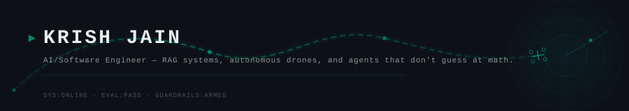
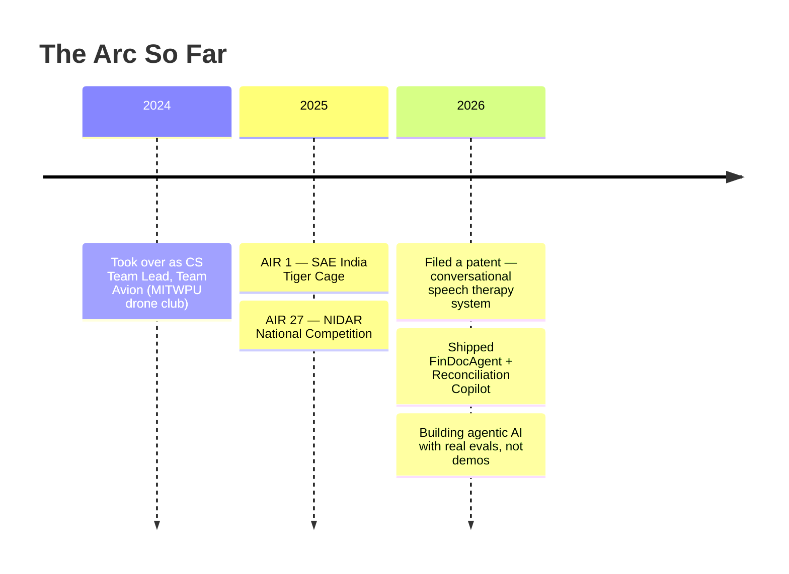

<p align="center">
  
</p>

```
> MISSION_CONTROL v3.2.1 — boot sequence initiated

[OK]  Drone mission control — live across 2 national competitions, AIR 1 nationally
[OK]  Agentic AI shipped — 1.0 correctness, 100% out-of-scope refusal on golden evals
[OK]  Patent filed — conversational speech therapy system (MIT WPU)
[OK]  LLMs don't do math here — every number comes from a deterministic tool
[STANDBY]  Awaiting next mission...
```

---

### About Me

I lead **Team Avion**, a 6-person drone team that placed **AIR 1 at SAE India Nationals**. My core work is agentic AI — systems with real evaluation harnesses, deterministic tool use, and guardrails that actually get enforced, not just documented. I build across the full stack: drone telemetry and flight control, LLM backends with structured retrieval, iOS apps with on-device ML, and cross-platform mobile apps.

---

### The Arc So Far



---

### Mission Log

| MISSION | STATUS | STACK | ONE-LINE RESULT |
|:--------|:------:|:------|:----------------|
| **FinDocAgent** | ✅ Deployed | LangGraph · FastAPI · ChromaDB · Groq | 1.0 correctness on golden eval, 100% out-of-scope refusal |
| **Team Avion — Mission Control** | 🛰️ Active | React.js · Python · MAVLink · WebSockets | AIR 1 + AIR 5 at SAE India Nationals |
| **Reconciliation Copilot** | 🧪 In Eval | LangGraph · pandas · Streamlit | 100% classification accuracy, 100% PII safety |
| **Spasht — Speech Analysis (iOS)** | 📄 Filed | Swift · UIKit · WhisperKit · Supabase | Patent filed — conversational speech therapy (MIT WPU) |
| **Code-Aware RAG Assistant** | ✅ Deployed | Tree-sitter · FastAPI · ChromaDB · Chrome ext | AST-aware code retrieval for GitHub repos |
| **Autonomous Drone Dashboard** | 🛰️ Active | Python · pymavlink · Next.js · Leaflet | Automated coverage-path mission planning |
| **CriThi (क्रिथि)** | 🛰️ Active | Flutter · Riverpod · NestJS | Gamified critical thinking for Grades 6–12 |

<sub>✅ Deployed &nbsp;·&nbsp; 🛰️ Active &nbsp;·&nbsp; 📄 Filed &nbsp;·&nbsp; 🧪 In Eval</sub>

---

### Achievements

| Competition | Result |
|:------------|:-------|
| SAE India Tiger Cage — National Competition | **All India Rank 1** |
| SAE India — National Competition | **All India Rank 5** |
| NIDAR — National Drone Competition | All India Rank 27 |

---

### Tech Stack

| | |
|:--|:--|
| **Languages** | Python · Swift · TypeScript · JavaScript |
| **AI / ML** | LangGraph · LangChain · Groq · ChromaDB · sentence-transformers · Tree-sitter · WhisperKit |
| **Backend** | FastAPI · NestJS · WebSockets · Supabase |
| **Robotics** | MAVLink · pymavlink · Pixhawk · ArduPilot |
| **Frontend** | React.js · Next.js · Flutter · Streamlit |
| **Infra** | Docker · pytest · GitHub Actions |

---

<details>
<summary>📡 <b>Me Beyond Tech</b></summary>
<br>

🗺️ When I'm not debugging drones or arguing with an LLM about math, I'm usually planning the next trip — exploring new places is basically my version of a system reset.

🏍️ Bike rides are where I do my best thinking. No IDE, no guardrails, just roads.

⛰️ Trekking is the only stack trace I actually enjoy following — one step at a time, no idea what's at the top until you get there.

</details>

---

<p align="center">
  <sub>Open to <b>Software / AI Engineering internships</b> · <a href="https://github.com/Krishjain10">github.com/Krishjain10</a></sub>
</p>
