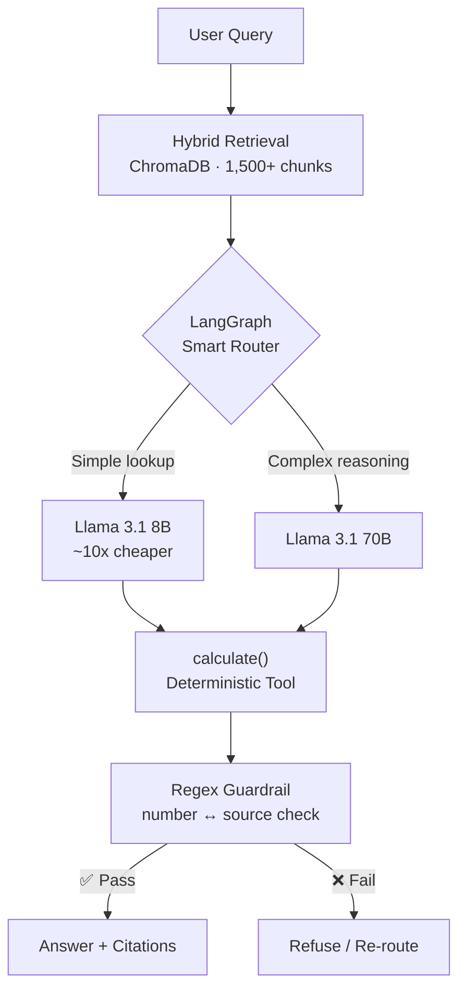

<p align="center">
  
</p>

```
> MISSION_CONTROL v3.2.1 — boot sequence initiated

[OK]  Drone telemetry pipeline online — 2 concurrent drones, live GPS via MAVLink
[OK]  RAG index mounted — 1,500+ chunks, 4 SEC tickers, hybrid retrieval <2s
[OK]  Guardrails armed — LLM math disabled, deterministic calculate() only
[OK]  Patent filed — conversational speech therapy system (MIT WPU, Patents Act 1970)
[OK]  Eval harness green — 32/32 FinDocAgent, 17/17 Reconciliation Copilot
[STANDBY]  Awaiting next mission...
```

---

### About Me

I lead **Team Avion**, a 6-person drone team that placed **AIR 1 at SAE India Nationals**. My core work is agentic AI — LangGraph systems with real evaluation harnesses, deterministic tool use, and guardrails that actually get enforced, not just documented. I build across the full stack: embedded telemetry with MAVLink and Pixhawk, FastAPI backends with vector retrieval, iOS apps with on-device ML, and Flutter mobile apps.

---

### How I Build

> **LLMs explain, they don't calculate.**
> Every number in FinDocAgent and Reconciliation Copilot passes through a deterministic `calculate()` tool or matching engine — the model never does arithmetic.

> **PII is tokenized before the model sees it.**
> Reconciliation Copilot hashes account numbers, IFSC, email, and PAN via HMAC-SHA-256 before anything reaches the LLM; a second regex guard layer catches anything that slips through.

> **Parse structure, don't chunk text.**
> Code-Aware RAG uses Tree-sitter ASTs to chunk repositories by semantic structure — functions, classes, modules — not arbitrary token windows.

> **Keep audio on-device when privacy matters.**
> Spasht runs WhisperKit transcription locally on iOS; raw speech audio never leaves the user's phone.

---

### Mission Log

| MISSION | STATUS | STACK | ONE-LINE RESULT |
|:--------|:------:|:------|:----------------|
| **FinDocAgent** | ✅ Deployed | LangGraph · FastAPI · ChromaDB · Groq | 1.0 correctness on 32-question golden eval, 100% OOS refusal |
| **Team Avion — Mission Control** | 🛰️ Active | React.js · Python · MAVLink · WebSockets | AIR 1 + AIR 5 at SAE India Nationals |
| **Reconciliation Copilot** | 🧪 In Eval | LangGraph · pandas · Streamlit | 17/17 golden eval, 100% PII safety, 61/61 tests |
| **Spasht — Speech Analysis (iOS)** | 📄 Filed | Swift · UIKit · WhisperKit · Supabase | Patent filed — conversational speech therapy (MIT WPU) |
| **Code-Aware RAG Assistant** | ✅ Deployed | Tree-sitter · FastAPI · ChromaDB · Chrome ext | Structure-aware chunking via AST, BM25 hybrid search |
| **Autonomous Drone Dashboard** | 🛰️ Active | Python · pymavlink · Next.js · Leaflet | Coverage-path generation + ArduPilot mission files |
| **CriThi (क्रिथि)** | 🛰️ Active | Flutter · Riverpod · NestJS | Gamified critical thinking for Grades 6–12 |

<sub>✅ Deployed &nbsp;·&nbsp; 🛰️ Active &nbsp;·&nbsp; 📄 Filed &nbsp;·&nbsp; 🧪 In Eval</sub>

---

### Architecture — FinDocAgent



---

### Achievements

| Competition | Result |
|:------------|:-------|
| SAE India Tiger Cage — National Competition | **All India Rank 1** |
| SAE India — National Competition | **All India Rank 5** |
| NIDAR — National Drone Competition | All India Rank 27 |

---

### Tech Stack

| | |
|:--|:--|
| **Languages** | Python · Swift · TypeScript · JavaScript · Dart |
| **AI / ML** | LangGraph · LangChain · Groq · ChromaDB · sentence-transformers · Tree-sitter · WhisperKit |
| **Backend** | FastAPI · NestJS · WebSockets · Supabase |
| **Robotics** | MAVLink · pymavlink · Pixhawk · ArduPilot |
| **Frontend** | React.js · Next.js · Flutter · Streamlit |
| **Infra** | Docker · pytest · GitHub Actions |

---

<p align="center">
  <sub>Open to <b>Software / AI Engineering internships</b> · <a href="https://github.com/Krishjain10">github.com/Krishjain10</a></sub>
</p>
